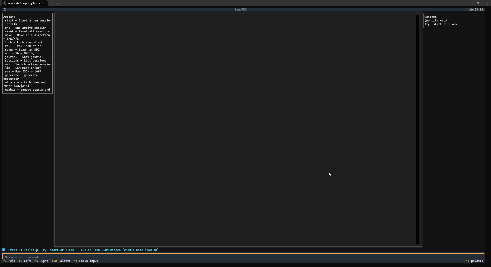

mistra-instruct-dnd
====================
# Dnd that works on mistral-7b-instruct-v0.2.Q4_K_M that runs on ollama for windows
## Testing gpt5 coding abilities

You can use the commands listed bellow to create a dnd campaing

# trying to make to work with moe model that runs on ollama 
- lots of dependency issues, frequent changes in the llama.cpp break stuff often which requires community to fix it and then publish the new model
- examples
  - https://github.com/ggml-org/llama.cpp/issues/10244
  - https://huggingface.co/TheBloke/dolphin-2.7-mixtral-8x7b-GGUF/discussions/4

Sometimes building with ollama can say that everything is successfull but the model is syntatcly correct but for examples points to weights/vector  that are changed
- my interperation. 
So to mitigate that its preferable to use linux/wsl
- create venv recomended
- find the requrements txt
- install requirements 
- sudo apt update
- sudo apt install build-essential cmake git git-lfs -y
- clone newest version of llama
- build it - steps ab
```bash
   # Navigate to your project folder
  cd ~ 
  # Activate the venv
  source gguf_forge_linux/bin/activate
  ```

```bash
  # Navigate to the llama.cpp directory
  cd llama.cpp

  # Clean any old attempts
  rm -rf build
  mkdir build
  cd build

  # Configure and build
  cmake .. -DGGML_CUDA=ON -DLLAMA_CURL=OFF
  cmake --build . --config Release
  ``` 

- note curl=off is optional some architecture issue (afaik) for my system

```bash
  ./build/bin/llama-cli -m ./models/mixtral-8x7b-instruct-v0.1.Q5_K_M.gguf \
--color \
-c 4096 \
-n 256 \
-i \
--system-prompt "You are a creative and helpful Dungeons & Dragons narrator and game master. You have access to a set of tools. You use humor where appropriate, and when writing you are clear, concise, and terse. Your stories should not be more than 300 characters."
```
From llama.cpp 

- note: cuda and curl parameter can be different based on env 

- Requirements:
- Download the model in question or other
- Create a modelfile or use the existing one
```bash
ollama create model -f Modelfile
```
```bash
ollama run model:latest
``` 
Or check what 
```bash 
ollama list
```
- install dependencies
```bash
python run llm_tools_server
```
```bash
python run loop --tui
```


Quickstart
----------
- Python 3.10+
- Optional LLM narrative: install and run `ollama` with a model named `dnd-writer` (or set `OLLAMA_MODEL`).
- TUI requires `textual`. Tool server requires `fastmcp`.

Install deps (minimal):
```
pip install textual mcp[fastmcp]
```

CLI mode
--------
- Run: `python loop.py`
- Built-ins (colon commands):
  - `:start`, `:end`, `:reset`
  - `:move <north|south|east|west|up|down|forward|back|left|right>`
  - `:look`
  - `:spawn [name] [kind]`, `:npc <id>`
  - `:journal`, `:sessions`, `:use <session_id>`, `:tools`, `:help`, `:suggest`, `:ui`
  - Combat: `:generate encounter [name] [kind]` | `:attack "weapon" "NdM" [adv|dis]` | `:combat status` | `:combat end`
- Dice:
  - `:roll NdM` (e.g., `:roll 2d6`)
  - `!roll NdM` and `!roll-a dM` (advantage) also supported
- Free chat: any text without a leading `:`/`!` sends to the LLM for narrative. 

TUI mode (Textual) 
------------------
- Run: `python -m ui.tui` (or from CLI type `:ui`)
- Left: actions list; Center: transcript; Right: context (tile, NPCs, items, combat).
- Type in the bottom input; supports the same colon commands as CLI.
- Extra toggles:
  - `:llm on|off` — enable/disable LLM narrative
  - `:raw on|off` — show/hide raw JSON payloads in the center pane
- Dice in TUI:
  - `:roll NdM` and `!roll NdM`/`!roll-a dM` shortcuts

MCP tool server (optional)
--------------------------
- Run: `python -m tools.llm_tools_server`
- Exposes tools (start/move/look/journal/spawn/getNpc/combat/roll, etc.) via FastMCP for external agents.
 
 Available tools (MCP)
 ---------------------
 - `summarize_file(path, max_lines=200)`:
   - Return first N non-empty lines summary of a file.
 - `function_skeleton(name, docstring=None)`:
   - Generate a minimal typed Python function skeleton as text.
 - `roll_dice_tool(notation)`:
   - Roll NdM or dM; returns `{notation,count,sides,rolls,total}`.
 - `roll_with_advantage_tool(notation)`:
   - Roll dM with advantage; returns `{rolls,result,message,...}`.
 - `start_session(theme=None, tone=None, max_narrative_words=500)`:
   - Create a new session; returns initial tile payload and sets active.
 - `move(direction, session_id=None)`:
   - Move cardinal or relative (`forward/back/left/right`); returns tile + `event_id`.
 - `look(session_id=None)`:
   - Return current tile payload without moving.
 - `log_narrative(text, event_id, session_id=None)`:
   - Record model narrative for a prior event; appends to journal.
 - `journal(session_id=None)`:
   - Return recent journal rollup for the session.
 - `spawn_npc(name=None, kind=None, session_id=None)`:
   - Spawn an NPC at current tile (AC 10–15); returns npc + message + `event_id`.
 - `get_npc(npc_id, session_id=None)`:
   - Fetch stored NPC by id.
 - `get_active_session()` / `set_active_session(session_id)` / `list_sessions()`:
   - Active pointer, switch active, list all sessions with brief status.
 - `end_session(session_id=None)`:
   - End and remove a session (defaults to active) and clear active if needed.
 - `reset_all()`:
   - Clear all sessions and active pointer.
 - `generate_encounter(name=None, kind=None, session_id=None)`:
   - Convenience: spawn one enemy, initialize combat, log start; returns tile + message + `event_id`.
 - `attack(weapon="attack", damage="1d6", advantage=False, disadvantage=False, player_roll=None, session_id=None)`:
   - Resolve player attack vs first enemy, apply crit/damage, enemy auto-retaliates; returns combat snapshot + readable `message`.
 - `combat_status(session_id=None)`:
   - Return current combat summary (active, enemies, round, log tail).
 - `combat_end(session_id=None)`:
   - End combat and clear state. Returns `{ok, event_id, message}`.
 - `health()` / `ping()` / `echo(text)`:
   - Health payload, liveness check, and echo util.
 
 Aliases (camelCase)
 -------------------
 - Mirrors snake_case: `startSession`, `moveDir`, `lookAround`, `logNarrative`, `journalSummary`, `getActiveSession`, `setActiveSession`, `listSessions`, `endSession`, `resetAll`, `spawnNpc`, `getNpc`, `generateEncounter`, `combatStatus`, `combatEnd`.

Implemented vs Feature.md
-------------------------
- Implemented:
  - `:generate encounter` tool reuses spawn logic and starts combat.
  - Free talk anytime (CLI and TUI), narrative grounded on last tile when available.
  - Enemy state tracked and shown (CLI prints summary; TUI context panel/combat blocks).
  - Simple combat loop: player attack (hit/crit, damage), auto enemy strike, readable outcome.
  - `:combat end` clears combat state and prints "The battle is finished.".
  - All other session tools preserved.
- Partial/mismatches:
  - Custom feature tools live in `tools/llm_tools_server.py`, not `tools/dnd_tools.py` (which holds dice/damage utils). Generate encounter is implemented in the server, not dnd_tools.
  - TUI does not reuse the last `d20` from `:roll` for `:attack` (CLI does). Server supports `player_roll` but TUI/`GameClient` don’t pass it yet.
  - "UI should not call any tool directly": current TUI/CLI import server module functions directly (in-process) rather than calling the MCP subprocess. State is still shared, but it’s not an out-of-process call.

Command notes and discrepancies
------------------------------
- Both `:roll NdM` and `!roll NdM` exist. CLI and TUI accept both; `!roll-a dM` for advantage.
- Recommendation: document `:roll` as the primary command; keep `!roll`/`!roll-a` as shortcuts.
- `:generate encounter` also accepts misspelled `encouter` for convenience.

What to improve (engineering)
-----------------------------
- Unify dice/attack UX: track last d20 in TUI and pass to `attack(player_roll=…)`; expose `player_roll` in `GameClient.attack`.
- Normalize commands: prefer `:roll` everywhere; keep `!roll` as alias; reflect in help banners and docs.
- Separate concerns: have TUI/CLI call the MCP server over stdio (or a thin client) instead of importing the module, so UI never calls tools directly and server lifecycles are explicit.
- Reduce duplication between CLI and TUI (parsing, narrative, suggestions) by extracting shared utilities.
- Packaging: add `requirements.txt`/`pyproject.toml` and OS-specific install notes; pin `textual`, `mcp[fastmcp]`.
- Tests: add unit tests for dice parsing, combat hit/crit/damage, and session state transitions.
- Robustness: handle Ollama missing more gracefully in CLI banner; guard against both `adv` and `dis` flags together (cancel to normal roll in UI too).
- [ ] chekc if everything done in mcp server (hist)
- [ ] remove !roll from cli and tui, 
- [ ] find a way to somehow preserve this
    - [ ] investigatge
- [ ] Multiplayer (lol) 

License
-------
MIT (or project default).

